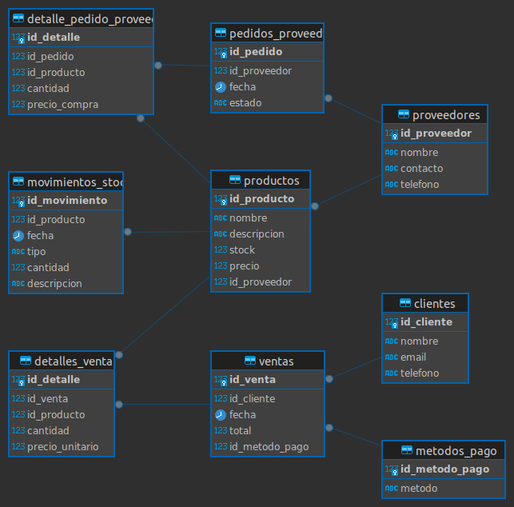

# Examen PostgreSQL

## Descripción

La tienda TechZone es un negocio dedicado a la venta de productos tecnológicos, desde laptops y
teléfonos hasta accesorios y componentes electrónicos. Con el crecimiento del comercio digital y
la alta demanda de dispositivos electrónicos, la empresa ha notado la necesidad de mejorar la
gestión de su inventario y ventas. Hasta ahora, han llevado el control de productos y
transacciones en hojas de cálculo, lo que ha generado problemas como:
🔹 Errores en el control de stock: No saben con certeza qué productos están por agotarse, lo
que ha llevado a problemas de desabastecimiento o acumulación innecesaria de productos en
bodega.
🔹 Dificultades en el seguimiento de ventas: No cuentan con un sistema eficiente para analizar
qué productos se venden más, en qué períodos del año hay mayor demanda o quiénes son sus
clientes más frecuentes.
🔹 Gestión manual de proveedores: Los pedidos a proveedores se han realizado sin un historial
claro de compras y ventas, dificultando la negociación de mejores precios y la planificación del
abastecimiento.
🔹 Falta de automatización en el registro de compras: Cada vez que un cliente realiza una
compra, los empleados deben registrar manualmente los productos vendidos y actualizar el
inventario, lo que consume tiempo y es propenso a errores.
Para solucionar estos problemas, TechZone ha decidido implementar una base de datos en
PostgreSQL que le permita gestionar de manera eficiente su inventario, las ventas, los clientes y
los proveedores.
📋 Especificaciones del Sistema
La empresa necesita un sistema que registre todos los productos disponibles en la tienda,
clasificándolos por categoría y manteniendo un seguimiento de la cantidad en stock. Cada
producto tiene un proveedor asignado, por lo que también es fundamental llevar un registro de
los proveedores y los productos que suministran.
Cuando un cliente realiza una compra, el sistema debe registrar la venta y actualizar
automáticamente el inventario, asegurando que no se vendan productos que ya están agotados.
Además, la tienda quiere identificar qué productos se venden más, qué clientes compran con
mayor frecuencia y cuánto se ha generado en ventas en un período determinado.

## Modelo Entidad-Relación



## Instalación y Configuración

1. Clonar el repositorio.
2. Importar los archivos SQL a la base de datos PostgreSQL.
3. Ejecutar los scripts SQL en el siguiente orden:
- `db.sql`: Crea la base de datos y las tablas necesarias.
- `insert.sql`: Inserta los datos iniciales en las tablas.
- `queries.sql`: Contiene consultas de ejemplo para recuperar datos de la base de datos.
- `procedure.sql`: Define un procedimiento almacenado para realizar una tarea específica.

## Descripción de los scripts

- `db.sql`: Crea la base de datos y las tablas necesarias.
- `insert.sql`: Inserta los datos iniciales en las tablas.
- `queries.sql`: Contiene consultas de ejemplo para recuperar datos de la base de datos.
- `procedure.sql`: Define un procedimiento almacenado para realizar una tarea específica.

## Uso

Para ejecutar las consultas y el procedimiento almacenado en PostgreSQL, siga estos pasos:

1. Abra un cliente PostgreSQL.
2. Conéctese a la base de datos.
3. Ejecute las consultas y el procedimiento almacenado utilizando los comandos SQL adecuados.

```sql
